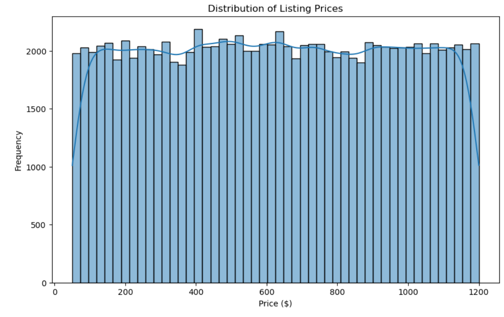
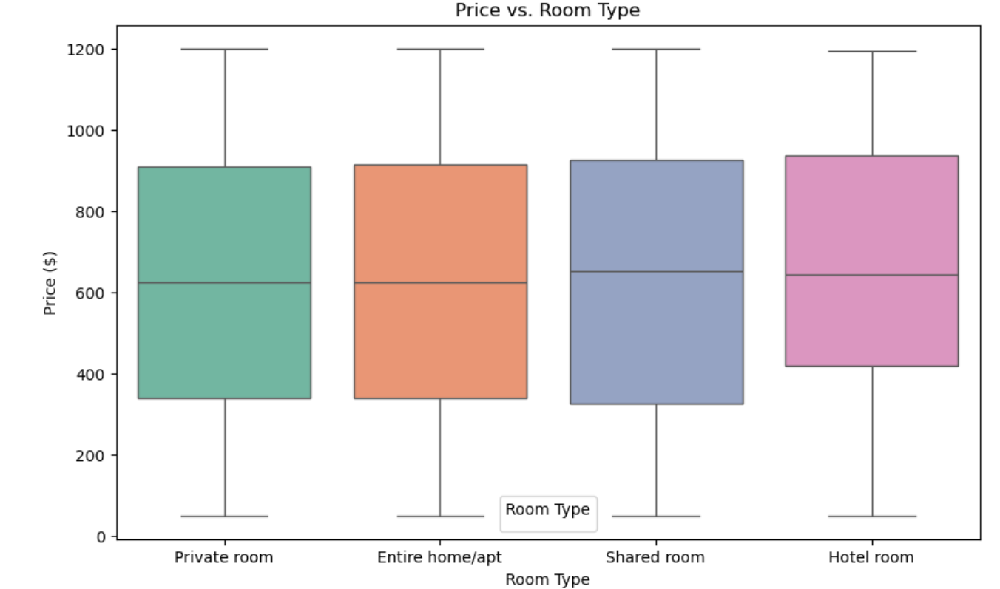
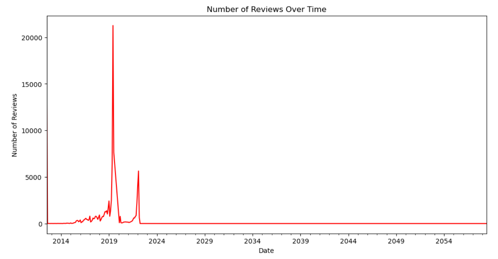

# 🏡 Airbnb Booking Analysis using Python

> An Exploratory Data Analysis (EDA) project that uncovers booking trends, pricing patterns, neighborhood popularity, and customer preferences using the Airbnb Open Dataset.


---

# 📌 Project Overview

The hospitality industry generates enormous amounts of booking and customer data every day. Analyzing this information helps property owners, travelers, and platforms like Airbnb make informed decisions regarding pricing, property management, customer satisfaction, and market demand.

In this project, I performed **Exploratory Data Analysis (EDA)** on the Airbnb Open Dataset using **Python**. The project focuses on cleaning raw booking data, exploring pricing trends, understanding customer reviews, analyzing neighborhood popularity, and visualizing important booking patterns.

The objective is to transform raw data into actionable business insights using Python and data visualization techniques.

---

# 🎯 Problem Statement

This project aims to answer important business questions such as:

* 🏘️ Which neighborhoods have the highest number of Airbnb listings?
* 🏠 Which room type is the most common?
* 💰 How are listing prices distributed?
* ⭐ How do prices differ across room types?
* 📅 How has customer review activity changed over time?
* 🌍 Which locations dominate the Airbnb marketplace?
* 📈 What trends can help hosts optimize their pricing strategy?

---

# 💼 Business Questions Answered

| Business Question                                          | Objective                                                                      |
| ---------------------------------------------------------- | ------------------------------------------------------------------------------ |
| 🏘️ Which neighborhood has the highest number of listings? | Identify the most popular Airbnb locations.                                    |
| 🏠 Which room type is most frequently listed?              | Understand customer accommodation preferences.                                 |
| 💰 What is the distribution of listing prices?             | Analyze overall pricing trends.                                                |
| 📊 How does price vary across different room types?        | Compare pricing between shared rooms, private rooms, hotels, and entire homes. |
| 📅 How has review activity changed over time?              | Discover seasonal or long-term booking trends.                                 |
| ⭐ Which listings receive the highest customer engagement?  | Understand customer interaction through reviews.                               |
| 🏡 Which property types dominate the platform?             | Identify the most common accommodation offerings.                              |
| 📍 Which boroughs have the largest Airbnb presence?        | Analyze geographical concentration of listings.                                |

---

# 🎯 Expected Outcomes

This project helps to:

* Understand Airbnb market trends.
* Analyze customer accommodation preferences.
* Discover pricing behavior across different room types.
* Identify high-demand neighborhoods.
* Explore customer engagement through review analysis.
* Demonstrate practical Exploratory Data Analysis (EDA) using Python.

---

# ✨ Project Highlights

* 📊 Performed end-to-end Exploratory Data Analysis.
* 🧹 Cleaned and preprocessed over 100,000 Airbnb listings.
* 🔍 Handled missing values, duplicates, and incorrect data types.
* 📈 Built informative visualizations using Matplotlib and Seaborn.
* 💡 Generated actionable insights from booking and pricing data.
* 📒 Developed entirely in Jupyter Notebook.

---

# 🛠️ Tech Stack

* Python
* Pandas
* NumPy
* Matplotlib
* Seaborn
* Jupyter Notebook

---

# 📂 Project Structure

```text
Airbnb-Booking-Analysis/
│
├── data/
│   └── Dataset zipped
│
├── notebooks/
│   └── Airbnb_Booking_Analysis.ipynb
│
├── images/
│   ├── price_distribution.png
│   ├── room_type_distribution.png
│   ├── neighborhood_distribution.png
│   ├── price_vs_roomtype.png
│   ├── reviews_over_time.png
│   └── correlation_heatmap.png
│
├── requirements.txt
├── README.md
└── LICENSE
```

---

# 📊 Dataset Information

The dataset contains Airbnb listing information including:

* Listing ID
* Property Name
* Host Details
* Host Verification Status
* Neighborhood Group
* Neighborhood
* Latitude & Longitude
* Room Type
* Construction Year
* Listing Price
* Service Fee
* Minimum Nights
* Number of Reviews
* Reviews Per Month
* Review Ratings
* Availability
* Cancellation Policy
* Instant Booking Availability

---

# 🧹 Data Cleaning

Before performing analysis, the dataset underwent extensive preprocessing.

### ✔ Missing Value Treatment

* Converted review dates into datetime format.
* Filled missing review information.
* Removed records with missing listing names and host names.
* Checked null values across all columns.

### ✔ Data Type Conversion

* Converted prices from string format to numerical values.
* Removed currency symbols.
* Converted service fee into float datatype.

### ✔ Duplicate Removal

* Removed duplicate listings.

### ✔ Data Validation

* Verified data types.
* Confirmed cleaned dataset using `.info()` and `.describe()`.

---

# 🔍 Exploratory Data Analysis Workflow

### 1️⃣ Data Loading

* Imported dataset
* Displayed initial records
* Examined column names

### 2️⃣ Data Cleaning

* Missing value handling
* Data type correction
* Duplicate removal
* Feature validation

### 3️⃣ Exploratory Analysis

Performed analysis on:

* Price Distribution
* Room Type Distribution
* Neighborhood Popularity
* Price vs Room Type
* Reviews Over Time
* Listing Availability
* Customer Ratings
* Host Listings

---

# 📈 Visualizations

The project includes several visualizations:

* 📊 Histogram
* 📦 Box Plot
* 📈 Line Chart
* 📉 Count Plot
* 🔥 Heatmap
* 📍 Neighborhood Distribution Charts

---

# 📊 Analysis Performed

### 💰 Price Distribution

Analyzed the overall spread of Airbnb listing prices to identify common price ranges and premium listings.

---

### 🏠 Room Type Distribution

Compared the frequency of:

* Entire Home / Apartment
* Private Room
* Shared Room
* Hotel Room

---

### 🏘️ Neighborhood Analysis

Identified neighborhoods with the largest number of Airbnb listings and visualized geographical concentration.

---

### 💵 Price vs Room Type

Compared pricing across different accommodation types using box plots.

---

### 📅 Reviews Over Time

Studied customer review activity to identify seasonal booking patterns and market trends.

---

# 💡 Key Insights

## 🏘️ Neighborhood Popularity

* Manhattan and Brooklyn contain the largest number of Airbnb listings.
* Other boroughs have significantly fewer properties.

---

## 🏠 Room Types

* Entire homes/apartments dominate the Airbnb marketplace.
* Private rooms are the second most popular accommodation option.

---

## 💰 Pricing Trends

* Most Airbnb listings fall within a moderate price range.
* Premium listings exist but represent a smaller portion of the market.

---

## 📊 Price Comparison

* Entire homes generally command the highest prices.
* Shared rooms are the most affordable accommodation type.

---

## 📅 Customer Engagement

* Customer review activity changes over time, indicating seasonal booking behavior.
* Certain periods experience noticeably higher review volumes.

---

## ⭐ Market Insights

* Popular neighborhoods attract higher listing density.
* Diverse accommodation options cater to different traveler budgets.

---

# 📌 Business Recommendations

Based on the analysis:

* 💰 Hosts should optimize pricing based on neighborhood demand.
* 🏡 Property owners can improve occupancy by offering competitive pricing.
* 📈 Airbnb can recommend pricing strategies using historical booking trends.
* 🌍 Investors should focus on neighborhoods with consistently high listing demand.
* ⭐ Hosts should maintain high-quality service to encourage positive reviews and repeat bookings.

---

# 🚀 Getting Started

## Clone the Repository

```bash
git clone https://github.com/yourusername/Airbnb-Booking-Analysis.git
```

---

## Install Dependencies

```bash
pip install -r requirements.txt
```

---

## Launch Jupyter Notebook

```bash
jupyter notebook
```

Open:

```text
notebooks/Airbnb_Booking_Analysis.ipynb
```

---

# 📸 Sample Outputs

Store your generated plots inside the **images/** folder and showcase them here.

Example:







---

# 📚 Skills Demonstrated

* Data Cleaning
* Data Preprocessing
* Exploratory Data Analysis (EDA)
* Feature Engineering
* Statistical Analysis
* Data Visualization
* Business Insight Generation
* Python for Data Analytics
* Problem Solving
* Data Storytelling

---

# 🔮 Future Improvements

Possible enhancements include:

* 📊 Interactive dashboards using Power BI or Tableau.
* 🌍 Geospatial analysis using Folium or Plotly Maps.
* 🤖 Machine Learning model for Airbnb price prediction.
* 📈 Time-series forecasting for booking demand.
* 🧠 Customer segmentation using clustering techniques.
* ☁️ Deploy the project using Streamlit for interactive exploration.

---

# 📖 Learning Outcomes

Through this project, I gained hands-on experience in:

* Cleaning real-world datasets
* Handling missing values and inconsistent data
* Performing exploratory data analysis
* Creating meaningful visualizations
* Extracting actionable business insights
* Communicating findings through data storytelling

---

# 👩‍💻 Author

Latika Manoj Ray

Aspiring Data Analyst | Python | SQL | Power BI | Data Visualization | Machine Learning

⭐ If you found this project useful, consider giving the repository a Star!
